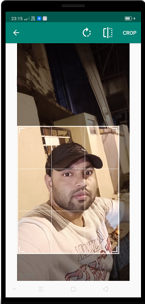

# ImagePickerWithCrop
library to pick images from gallery or camera and crop them if needed.
# Demonstration
|Demo Picker Image|
|:---:|
||

[](https://jitpack.io/#kaju02525/ImagePickerWithCrop)


## Usage
Add this line to build.gradle
```
	 implementation 'com.github.kaju02525:ImagePickerWithCrop:0.1.0'
   
   maven { url 'https://jitpack.io' }
   
```

```
in Kotlin

 imagePicker = ImagePicker(this, null, object : OnImagePickedListener {
                override fun onImagePicked(imageUri: Uri?) {

                   imagePicker.setFileSize(500) //setSize/Resize
                  val filePath = imagePicker.getImageFile()
                  val bitmap = imagePicker.getBitmap()
                  val fileSize = imagePicker.getFileSize()
                  val imageUri = imageUri

                   image.setImageURI(imageUri)
                  // image.setImageBitmap(bitmap)
                }
            }).setWithImageCrop(true) //this is optional you need crop image just user this method
            
            // open dailog
            imagePicker.choosePicture(true)


             override fun onActivityResult(requestCode: Int, resultCode: Int, data: Intent?) {
                    super.onActivityResult(requestCode, resultCode, data)
                    imagePicker.handleActivityResult(resultCode, requestCode, data)
                }

                override fun onRequestPermissionsResult(requestCode: Int, permissions: Array<String?>, grantResults: IntArray) {
                    super.onRequestPermissionsResult(requestCode, permissions, grantResults)
                    imagePicker.handlePermission(requestCode, grantResults)
                }


```

### Create new instance and save it as field
```java
imagePicker = new ImagePicker(this, /* activity non null*/
                null, /* fragment nullable*/
                imageUri -> {/*on image picked */
                    imageView.setImageURI(imageUri);
                })
                .setWithImageCrop(
                        1 /*aspect ratio x*/
                        1 /*aspect ratio y*/);
```


### If calling from Activity
Override Activity's methods to delegate permissions to ImagePicker and resulting image
```java
@Override
protected void onActivityResult(int requestCode, int resultCode, Intent data) {
    super.onActivityResult(requestCode, resultCode, data);
    imagePicker.handleActivityResult(resultCode,requestCode, data);
}
@Override
public void onRequestPermissionsResult(int requestCode, @NonNull String[] permissions, @NonNull int[] grantResults) {
    super.onRequestPermissionsResult(requestCode, permissions, grantResults);
    imagePicker.handlePermission(requestCode, grantResults);
}
```
### Open Picker
There's two methods available
```java
imagePicker.openCamera();
imagePicker.choosePicture(true /*show camera intents*/);
```
First one opens camera directly, second shows an intent picker, where user picks from desired application. You can include/exclude camera intents with boolean.

That's it, if you don't need to crop image, don't call *setWithImageCrop()*  in the chain. By default it's disabled. And if you want to get a file after you picked image, you can get it with this method
```java
File file = imagePicker.getImageFile();
```
### If calling from Fragment 
Create instance 
```java
imagePicker = new ImagePicker(getActivity(),
                this,
                imageUri -> {/*on image picked */
                    imageView.setImageURI(imageUri);
                })
                .setWithImageCrop(
                        1 /*aspect ratio x*/
                        1 /*aspect ratio y*/);
```

Overriden methods should be in your Fragment

```java
@Override
public void onActivityResult(int requestCode, int resultCode, Intent data) {
    super.onActivityResult(requestCode, resultCode, data);
    imagePicker.handleActivityResult(resultCode, requestCode, data);
}
@Override
public void onRequestPermissionsResult(int requestCode, @NonNull String[] permissions, @NonNull int[] grantResults) {
    super.onRequestPermissionsResult(requestCode, permissions, grantResults);
    imagePicker.handlePermission(requestCode, grantResults);
}
```
But your fragment won't get activity result callback itself. You need to call it manually. Add this code to activity that hosts your fragment

```java
@Override
protected void onActivityResult(int requestCode, int resultCode, Intent data) {
    super.onActivityResult(requestCode, resultCode, data);
    List<Fragment> fragments = getSupportFragmentManager().getFragments();
    if (fragments != null) {
        for (Fragment f : fragments) {
            if (f instanceof YourFragment) {
                f.onActivityResult(requestCode, resultCode, data);
            }
        }
    }
}
```
